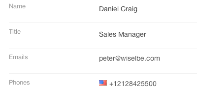
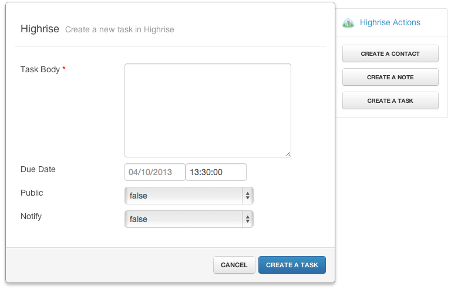

# Talkdesk Integration

Integrations are one of the core features of Talkdesk. They give our users the possibility to integrate with the services they already use - their CRM, Helpdesk, internal database. This way they don't need to manually insert information in their CRM about calls nor be on the phone with multiple systems opened trying to find information about the caller.

Talkdesk already integrates with some of this systems - Google Contacts, Salesforce, Desk.com. [See the complete list of Talkdesk integrations](http://www.talkdesk.com/call-center-software/integrations).

The commom operations when integrating Talkdesk and a 3rd party system are:

#### Contact retrieval:

Contacts from the external integration are synchronized with Talkdesk giving our customers:

- the ability to call contacts they already have in another service.
- recognition of the person who is calling if the contact exists in the integrated system

#### Interaction retrieval:

Ability to see previous interactions the customer had with the company (previous emails, support requests, meetings, calls, web chats or any other interaction that is available in the target system).

- all the information about the customer is presented in a single interface to the agent that picks up the phone

#### Action execution:

Add support to send information to the destination system. This gives:

- flexibility to create contacts, support requests, etc, in the target system without having to open another system

Not every integration has these 3 operations available. For example, Google Contacts only supports contact synchronization. Other more advanced systems support the 3 operations.

For a more complete overview of the flow, see this little video which should be able to give you an idea of how an agent interacts with the system using Desk.com as an integration: http://talkdeskapp.s3.amazonaws.com/resources/vids/UseCaseDemos.mp4

## The Challenge

Your mission, should you choose to accept it, involves building an integration for Talkdesk (for a system such as Intercom or any other if you like). This is what we would have to do to integrate with some other system or what a client would to if they wanted Talkdesk to retrieve data from their own custom systems.

Next steps:

- Look at our API: https://github.com/Talkdesk/api
- Try build as much of the integration you can, but if you need a prioritized listed, use:
  - Implement contact synchronization
  - Implement 1 or 2 actions
  - Implement interaction retrieval

*Final note*: If there's anything you don't understand or is ambiguous, open an issue in your repository with the question ;)

---

[Go back to the Problems README](README.md)
